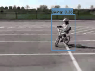
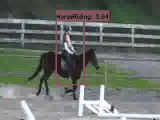
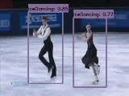
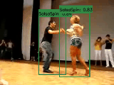

# YOWO-Plus: An incremental improvement

Big thanks to [YOWO](https://github.com/wei-tim/YOWO) for their open source. I reimplemented ```YOWO``` and reproduced the performance. On the ```AVA``` dataset, my reproduced YOWO is better than the official YOWO. We named this YOWO as **YOWO-Plus**. I hope that such a real-time action detector with simple structure and superior performance can attract your interest in the task of spatio-temporal action detection.

Paper: [arxiv](https://arxiv.org/pdf/2210.11219)

# Improvement
- Better 2D backbone: We use the weights of YOLOv2 from our [project](https://github.com/yjh0410/PyTorch_YOLOv2). Our YOLOv2 achieves a significantly higher AP on the COCO dataset.

- Better label assignment: For a groundtruth, we assign the anchor boxes with IoU higher than the threshold 0.5, so each groundtruth might be assigned
with multiple anchor boxes.

- Better loss: We deploy *GIoU loss* as the box regression loss. As for the conference loss and classification loss, they are same as the ones used in
YOWO. Finally, all the losses are normalized by the batch size.

# Requirements
- We recommend you to use Anaconda to create a conda environment:
```Shell
conda create -n yowo python=3.6
```

- Then, activate the environment:
```Shell
conda activate yowo
```

- Requirements:
```Shell
pip install -r requirements.txt 
```

# Visualization







# Dataset
You can download **UCF24** and **JHMDB21** from the following links:

## UCF101-24:
* Google drive

Link: https://drive.google.com/file/d/1Dwh90pRi7uGkH5qLRjQIFiEmMJrAog5J/view?usp=sharing

* BaiduYun Disk

Link: https://pan.baidu.com/s/11GZvbV0oAzBhNDVKXsVGKg

Password: hmu6 

## JHMDB21: 
* Google drive

Link: https://drive.google.com/file/d/15nAIGrWPD4eH3y5OTWHiUbjwsr-9VFKT/view?usp=sharing

* BaiduYun Disk

Link: https://pan.baidu.com/s/1HSDqKFWhx_vF_9x6-Hb8jA 

Password: tcjd 

## AVA
You can use instructions from [here](https://github.com/yjh0410/AVA_Dataset) to prepare **AVA** dataset.

# Experiment
* UCF101-24

|      Model   |  Clip  | GFLOPs | Frame mAP | Video mAP |   FPS   |    Weight    |
|--------------|--------|--------|-----------|-----------|---------|--------------|
|     YOWO     |   16   |  43.8  |    80.4   |   48.8    |    -    |       -      |
|  YOWO-Plus   |   16   |  43.8  |    84.9   |   50.5    |    36   | [github](https://github.com/yjh0410/PyTorch_YOWO/releases/download/yowo-weight/yowo_ucf24_84.9.pth)   |
|  YOWO-Nano   |   16   |   6.0  |    81.0   |   49.7    |    91   | [github](https://github.com/yjh0410/PyTorch_YOWO/releases/download/yowo-weight/yowo_nano_ucf24_81.0.pth)   |

* AVA v2.2

|     Model     |    Clip    |    mAP    |   FPS   |    weight    |
|---------------|------------|-----------|---------|--------------|
|     YOWO      |     16     |   17.9    |    31   |       -      |
|     YOWO      |     32     |   19.1    |    23   |       -      |
|  YOWO-Plus    |     16     |   20.6    |    33   |  [github](https://github.com/yjh0410/PyTorch_YOWO/releases/download/yowo-weight/yowo_ava_v2.2_20.6.pth)  |
|  YOWO-Plus    |     32     |   21.6    |    25   |  [github](https://github.com/yjh0410/PyTorch_YOWO/releases/download/yowo-weight/yowo_ava_v2.2_K32_21.6.pth)  |
|  YOWO-Nano    |     16     |   18.4    |    91   |  [github](https://github.com/yjh0410/PyTorch_YOWO/releases/download/yowo-weight/yowo_nano_ava_v2.2_18.4.pth)  |
|  YOWO-Nano    |     32     |   19.5    |    90    |  [github](https://github.com/yjh0410/PyTorch_YOWO/releases/download/yowo-weight/yowo_nano_ava_v2.2_K32_19.5.pth)  |

## Train YOWO
* UCF101-24

```Shell
python train.py --cuda -d ucf24 -v yowo --num_workers 4 --eval_epoch 1 --eval
```

or you can just run the script:

```Shell
sh train_ucf.sh
```

* AVA
```Shell
python train.py --cuda -d ava_v2.2 -v yowo --num_workers 4 --eval_epoch 1 --eval
```

or you can just run the script:

```Shell
sh train_ava.sh
```

##  Test YOWO
* UCF101-24
For example:

```Shell
python test.py --cuda -d ucf24 -v yowo --weight path/to/weight --show
```

* AVA
For example:

```Shell
python test.py --cuda -d ava_v2.2 -v yowo --weight path/to/weight --show
```

##  Test YOWO on AVA video
For example:

```Shell
python test_video_ava.py --cuda -d ava_v2.2 -v yowo --weight path/to/weight --video path/to/video --show
```

Note that you can set ```path/to/video``` to other videos in your local device, not AVA videos.

## Evaluate YOWO
* UCF101-24
For example:

```Shell
# Frame mAP
python eval.py \
        --cuda \
        -d ucf24 \
        -v yowo \
        -bs 8 \
        -size 224 \
        --weight path/to/weight \
        --cal_frame_mAP \
```

Our YOWO-Plus's result of frame mAP@0.5 IoU on UCF101-24:
```Shell
AP: 85.25% (1)
AP: 96.94% (10)
AP: 78.58% (11)
AP: 68.61% (12)
AP: 78.98% (13)
AP: 94.92% (14)
AP: 90.00% (15)
AP: 77.44% (16)
AP: 75.82% (17)
AP: 91.07% (18)
AP: 97.16% (19)
AP: 62.71% (2)
AP: 93.22% (20)
AP: 79.16% (21)
AP: 80.07% (22)
AP: 76.10% (23)
AP: 92.49% (24)
AP: 86.29% (3)
AP: 76.99% (4)
AP: 74.89% (5)
AP: 95.74% (6)
AP: 93.68% (7)
AP: 93.71% (8)
AP: 97.13% (9)
mAP: 84.87%
```

Our YOWO-Nano's result of frame mAP@0.5 IoU on UCF101-24:
```Shell
AP: 65.53% (1)
AP: 97.19% (10)
AP: 78.60% (11)
AP: 66.09% (12)
AP: 70.95% (13)
AP: 87.57% (14)
AP: 84.48% (15)
AP: 89.19% (16)
AP: 77.62% (17)
AP: 89.35% (18)
AP: 94.54% (19)
AP: 34.73% (2)
AP: 93.34% (20)
AP: 82.73% (21)
AP: 80.11% (22)
AP: 70.74% (23)
AP: 88.19% (24)
AP: 85.56% (3)
AP: 66.48% (4)
AP: 71.48% (5)
AP: 94.33% (6)
AP: 93.09% (7)
AP: 90.36% (8)
AP: 90.75% (9)
mAP: 80.96%
```

```Shell
# Video mAP
python eval.py \
        --cuda \
        -d ucf24 \
        -v yowo \
        -bs 8 \
        -size 224 \
        --weight path/to/weight \
        --cal_video_mAP \
```

Our YOWO-Plus's result of video mAP@0.5 IoU on UCF101-24:
```Shell
-------------------------------
V-mAP @ 0.05 IoU:
--Per AP:  [94.1, 99.64, 68.62, 97.44, 87.21, 100.0, 82.72, 100.0, 99.87, 96.08, 44.8, 92.43, 91.76, 100.0, 24.29, 92.53, 90.23, 96.55, 94.24, 63.46, 73.44, 51.48, 82.85, 88.67]
--mAP:  83.85
-------------------------------
V-mAP @ 0.1 IoU:
--Per AP:  [94.1, 97.37, 67.16, 97.44, 85.2, 100.0, 82.72, 100.0, 99.87, 96.08, 44.8, 92.43, 91.76, 100.0, 24.29, 92.53, 90.23, 96.55, 94.24, 63.46, 70.75, 51.48, 79.44, 88.67]
--mAP:  83.36
-------------------------------
V-mAP @ 0.2 IoU:
--Per AP:  [70.0, 97.37, 62.86, 89.47, 59.5, 100.0, 78.04, 100.0, 90.74, 96.08, 44.8, 92.43, 91.76, 100.0, 22.29, 92.53, 90.23, 96.55, 94.24, 58.8, 42.35, 48.03, 53.41, 88.67]
--mAP:  77.51
-------------------------------
V-mAP @ 0.3 IoU:
--Per AP:  [14.33, 48.86, 61.27, 76.36, 12.58, 87.34, 78.04, 100.0, 90.74, 93.28, 44.8, 89.89, 91.76, 100.0, 15.41, 92.53, 88.99, 96.55, 94.24, 51.4, 24.52, 42.89, 5.63, 78.64]
--mAP:  65.84
-------------------------------
V-mAP @ 0.5 IoU:
--Per AP:  [0.18, 1.9, 58.16, 33.87, 1.31, 44.26, 49.09, 100.0, 61.3, 91.23, 44.8, 70.06, 59.22, 100.0, 3.73, 92.53, 87.71, 89.53, 91.29, 45.06, 0.97, 20.94, 0.0, 65.41]
--mAP:  50.52
-------------------------------
V-mAP @ 0.75 IoU:
--Per AP:  [0.0, 0.0, 27.05, 0.0, 0.0, 0.56, 9.81, 69.56, 14.42, 31.74, 3.43, 29.46, 0.93, 48.21, 0.71, 61.32, 45.81, 16.04, 84.41, 14.2, 0.06, 0.96, 0.0, 35.95]
--mAP:  20.61
```

Our YOWO-Nano's result of video mAP@0.5 IoU on UCF101-24:
```Shell
-------------------------------
V-mAP @ 0.05 IoU:
--Per AP:  [82.6, 99.22, 65.57, 96.8, 83.21, 100.0, 79.01, 100.0, 97.19, 96.08, 44.73, 93.47, 91.15, 98.48, 23.33, 95.97, 91.44, 96.55, 93.81, 63.46, 70.45, 51.44, 87.88, 87.19]
--mAP:  82.88
-------------------------------
V-mAP @ 0.1 IoU:
--Per AP:  [82.6, 95.29, 65.57, 94.81, 83.21, 100.0, 79.01, 100.0, 97.19, 96.08, 44.73, 93.47, 91.15, 98.48, 23.33, 95.97, 91.44, 96.55, 93.81, 63.46, 67.26, 51.44, 80.33, 87.19]
--mAP:  82.18
-------------------------------
V-mAP @ 0.2 IoU:
--Per AP:  [50.67, 78.87, 63.91, 82.36, 50.96, 100.0, 79.01, 100.0, 87.87, 96.08, 44.73, 90.49, 91.15, 98.48, 21.79, 95.97, 91.44, 96.55, 93.81, 63.46, 44.19, 48.75, 34.85, 87.19]
--mAP:  74.69
-------------------------------
V-mAP @ 0.3 IoU:
--Per AP:  [9.19, 29.82, 60.21, 68.02, 16.21, 86.67, 74.23, 100.0, 87.87, 92.76, 44.73, 80.86, 91.15, 98.48, 14.07, 95.97, 91.44, 96.55, 93.81, 52.13, 24.71, 43.26, 5.53, 77.27]
--mAP:  63.96
-------------------------------
V-mAP @ 0.5 IoU:
--Per AP:  [0.0, 0.0, 58.56, 26.91, 5.7, 40.87, 56.73, 91.42, 58.24, 90.68, 44.73, 66.93, 54.1, 98.48, 5.71, 95.97, 86.61, 89.4, 91.0, 46.61, 0.66, 18.85, 0.0, 65.44]
--mAP:  49.73
-------------------------------
V-mAP @ 0.75 IoU:
--Per AP:  [0.0, 0.0, 21.81, 0.0, 0.0, 1.11, 7.33, 56.58, 7.69, 39.05, 9.47, 20.53, 0.0, 36.57, 2.25, 66.92, 32.27, 12.78, 69.46, 10.47, 0.04, 0.34, 0.0, 29.66]
--mAP:  17.68
```

* AVA

Run the following command to calculate frame mAP@0.5 IoU:

```Shell
python eval.py \
        --cuda \
        -d ava_v2.2 \
        -v yowo \
        --weight path/to/weight
```

Our YOWO-Plus's result of frame mAP@0.5 IoU on AVA-v2.2:
```Shell
AP@0.5IOU/answer phone: 0.6200712155913068,
AP@0.5IOU/bend/bow (at the waist): 0.3684199174015223,
AP@0.5IOU/carry/hold (an object): 0.4368366146575504,
AP@0.5IOU/climb (e.g., a mountain): 0.006524045204733175,
AP@0.5IOU/close (e.g., a door, a box): 0.10121428961033546,
AP@0.5IOU/crouch/kneel: 0.14271053289648555,
AP@0.5IOU/cut: 0.011371656268128742,
AP@0.5IOU/dance: 0.3472742170664651,
AP@0.5IOU/dress/put on clothing: 0.05568205010936085,
AP@0.5IOU/drink: 0.18867980887744548,
AP@0.5IOU/drive (e.g., a car, a truck): 0.5727336663149236,
AP@0.5IOU/eat: 0.2438949290288357,
AP@0.5IOU/enter: 0.03631300073681878,
AP@0.5IOU/fall down: 0.16097137034226533,
AP@0.5IOU/fight/hit (a person): 0.35295156111441717,
AP@0.5IOU/get up: 0.1661305661768072,
AP@0.5IOU/give/serve (an object) to (a person): 0.08171070895093906,
AP@0.5IOU/grab (a person): 0.04786212215222141,
AP@0.5IOU/hand clap: 0.16502425129399353,
AP@0.5IOU/hand shake: 0.05668297330776857,
AP@0.5IOU/hand wave: 0.0019633474257698715,
AP@0.5IOU/hit (an object): 0.004926567809641652,
AP@0.5IOU/hug (a person): 0.14948677865170307,
AP@0.5IOU/jump/leap: 0.11724856806405773,
AP@0.5IOU/kiss (a person): 0.18323100733498285,
AP@0.5IOU/lie/sleep: 0.5566160853381206,
AP@0.5IOU/lift (a person): 0.05071348972423068,
AP@0.5IOU/lift/pick up: 0.02400509697339648,
AP@0.5IOU/listen (e.g., to music): 0.008846030334678949,
AP@0.5IOU/listen to (a person): 0.6111863505487993,
AP@0.5IOU/martial art: 0.35494188472527066,
AP@0.5IOU/open (e.g., a window, a car door): 0.13838582757710105,
AP@0.5IOU/play musical instrument: 0.17637146118119046,
AP@0.5IOU/point to (an object): 0.0030957935199989314,
AP@0.5IOU/pull (an object): 0.006138508972102678,
AP@0.5IOU/push (an object): 0.008798412014783267,
AP@0.5IOU/push (another person): 0.06436728640658615,
AP@0.5IOU/put down: 0.011691087258412239,
AP@0.5IOU/read: 0.23947763826955498,
AP@0.5IOU/ride (e.g., a bike, a car, a horse): 0.3573836844473405,
AP@0.5IOU/run/jog: 0.3893352170239517,
AP@0.5IOU/sail boat: 0.09309936689447072,
AP@0.5IOU/shoot: 0.006834072970687,
AP@0.5IOU/sing to (e.g., self, a person, a group): 0.08181910176202781,
AP@0.5IOU/sit: 0.7709624420964878,
AP@0.5IOU/smoke: 0.05268953989999123,
AP@0.5IOU/stand: 0.7668298075740738,
AP@0.5IOU/swim: 0.17407407407407408,
AP@0.5IOU/take (an object) from (a person): 0.0383472793429592,
AP@0.5IOU/take a photo: 0.025915711741497306,
AP@0.5IOU/talk to (e.g., self, a person, a group): 0.7390988530695071,
AP@0.5IOU/text on/look at a cellphone: 0.009139739938803557,
AP@0.5IOU/throw: 0.015058496300738047,
AP@0.5IOU/touch (an object): 0.3090900998192289,
AP@0.5IOU/turn (e.g., a screwdriver): 0.01904009620734998,
AP@0.5IOU/walk: 0.6288594756415645,
AP@0.5IOU/watch (a person): 0.6489390785120175,
AP@0.5IOU/watch (e.g., TV): 0.11913599687628156,
AP@0.5IOU/work on a computer: 0.18941724461502552,
AP@0.5IOU/write: 0.022696113047944347,
mAP@0.5IOU: 0.20553860351814546
```

```Shell
AP@0.5IOU/answer phone: 0.5639651669314073,
AP@0.5IOU/bend/bow (at the waist): 0.33601517221666766,
AP@0.5IOU/carry/hold (an object): 0.4208577802547332,
AP@0.5IOU/climb (e.g., a mountain): 0.015362037830534558,
AP@0.5IOU/close (e.g., a door, a box): 0.05856722579699733,
AP@0.5IOU/crouch/kneel: 0.16270710742985536,
AP@0.5IOU/cut: 0.03259447757034726,
AP@0.5IOU/dance: 0.19936510569452462,
AP@0.5IOU/dress/put on clothing: 0.01974443432453662,
AP@0.5IOU/drink: 0.09356501752959727,
AP@0.5IOU/drive (e.g., a car, a truck): 0.5698893029493408,
AP@0.5IOU/eat: 0.19427064247923537,
AP@0.5IOU/enter: 0.022437662936697852,
AP@0.5IOU/fall down: 0.1913729400012108,
AP@0.5IOU/fight/hit (a person): 0.33869826417910914,
AP@0.5IOU/get up: 0.11046598370903302,
AP@0.5IOU/give/serve (an object) to (a person): 0.04165150003199611,
AP@0.5IOU/grab (a person): 0.039442366284766966,
AP@0.5IOU/hand clap: 0.0511105021063975,
AP@0.5IOU/hand shake: 0.010261407092347795,
AP@0.5IOU/hand wave: 0.004008741526772979,
AP@0.5IOU/hit (an object): 0.00635673102300397,
AP@0.5IOU/hug (a person): 0.12071949962695369,
AP@0.5IOU/jump/leap: 0.04288684128713736,
AP@0.5IOU/kiss (a person): 0.1509158942914109,
AP@0.5IOU/lie/sleep: 0.49796421561453186,
AP@0.5IOU/lift (a person): 0.048965276424816656,
AP@0.5IOU/lift/pick up: 0.021571795788197068,
AP@0.5IOU/listen (e.g., to music): 0.008597518435883253,
AP@0.5IOU/listen to (a person): 0.5717068364857729,
AP@0.5IOU/martial art: 0.30153108495935566,
AP@0.5IOU/open (e.g., a window, a car door): 0.13374910597196993,
AP@0.5IOU/play musical instrument: 0.06300166361621182,
AP@0.5IOU/point to (an object): 0.0009608316917870056,
AP@0.5IOU/pull (an object): 0.006314960498212668,
AP@0.5IOU/push (an object): 0.007886200720014886,
AP@0.5IOU/push (another person): 0.04178496002131167,
AP@0.5IOU/put down: 0.009678644121314455,
AP@0.5IOU/read: 0.12988728095972746,
AP@0.5IOU/ride (e.g., a bike, a car, a horse): 0.35723030069750433,
AP@0.5IOU/run/jog: 0.3304660793110652,
AP@0.5IOU/sail boat: 0.09961189675108656,
AP@0.5IOU/shoot: 0.002028200868641035,
AP@0.5IOU/sing to (e.g., self, a person, a group): 0.07922409715996187,
AP@0.5IOU/sit: 0.769997196390207,
AP@0.5IOU/smoke: 0.027182118963007835,
AP@0.5IOU/stand: 0.7644546148083041,
AP@0.5IOU/swim: 0.34791666666666665,
AP@0.5IOU/take (an object) from (a person): 0.026775853194284386,
AP@0.5IOU/take a photo: 0.02549066470092448,
AP@0.5IOU/talk to (e.g., self, a person, a group): 0.7072203473798517,
AP@0.5IOU/text on/look at a cellphone: 0.007649665742978625,
AP@0.5IOU/throw: 0.02350848266675922,
AP@0.5IOU/touch (an object): 0.3272209015074646,
AP@0.5IOU/turn (e.g., a screwdriver): 0.01293785657008335,
AP@0.5IOU/walk: 0.5949790093227657,
AP@0.5IOU/watch (a person): 0.624513189952497,
AP@0.5IOU/watch (e.g., TV): 0.0817558010886299,
AP@0.5IOU/work on a computer: 0.14103543044480588,
AP@0.5IOU/write: 0.04247217386708656,
mAP@0.5IOU: 0.18390837880780497
```

## Demo
```Shell
# run demo
python demo.py --cuda -d ucf24 -v yowo -size 224 --weight path/to/weight --video path/to/video
                      -d ava_v2.2
```

## References
If you are using our code, please consider citing our paper.

```
@article{yang2022yowo,
  title={YOWO-Plus: An Incremental Improvement},
  author={Yang, Jianhua},
  journal={arXiv preprint arXiv:2210.11219},
  year={2022}
}
```
